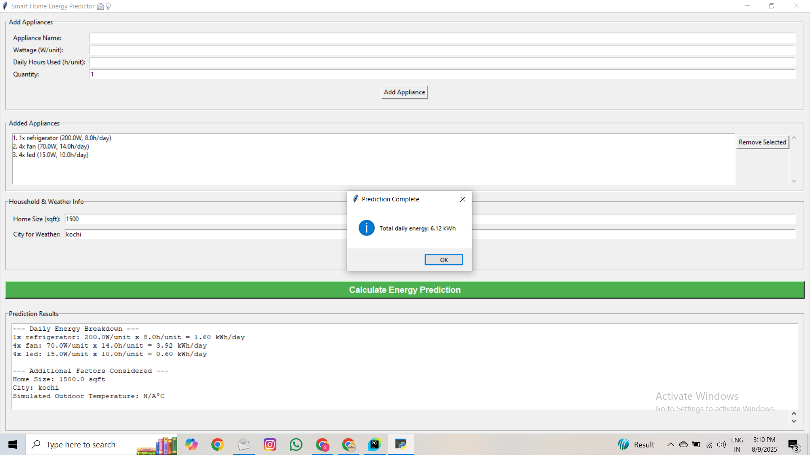

# ​ Smart Home Energy Predictor

A Python Tkinter desktop application that predicts household energy consumption based on appliance usage and weather conditions.

---

## ​ Preview
  
*(Replace with an actual screenshot)*

---

## ​ Features
- **Add & Manage Appliances** — name, wattage, daily usage hours, and quantity
- **Energy Prediction** — calculates daily kWh usage
- **Weather-Aware** — accepts a city name to include weather data in predictions
- **Clean Tkinter GUI** — easy to use, beginner-friendly

---

## ​ Tech Stack
- **Python 3.x**
- **Tkinter** for GUI
- **Requests** for API calls

---

## ​ Getting Started

### ​​​ Clone this repository
```bash
git clone https://github.com/Sreenitha-S/-Home-energy-consumption-prediction.git
cd -Home-energy-consumption-prediction
```

### ​​​ Install dependencies
```bash
pip install -r requirements.txt
```

### ​​​ Get your own OpenWeatherMap API Key
1. Go to [OpenWeatherMap](https://home.openweathermap.org/users/sign_up) and create a free account.
2. After signing in, navigate to the **API Keys** section in your profile.
3. Copy your personal **API key**.

---

### ​​​ Add your API key to the code
Open `energy_gui.py` (or wherever the API key variable is stored) and replace:
```python
API_KEY = "YOUR_OPENWEATHERMAP_API_KEY"
```
with:
```python
API_KEY = "your_actual_api_key_here"
```

---

### ​​​ Run the application
```bash
python energy_gui.py
```
